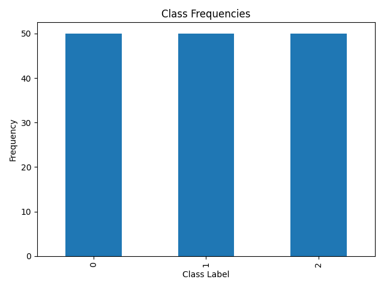
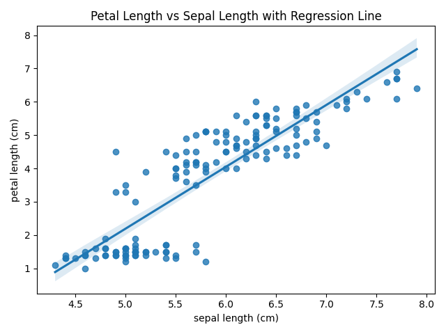
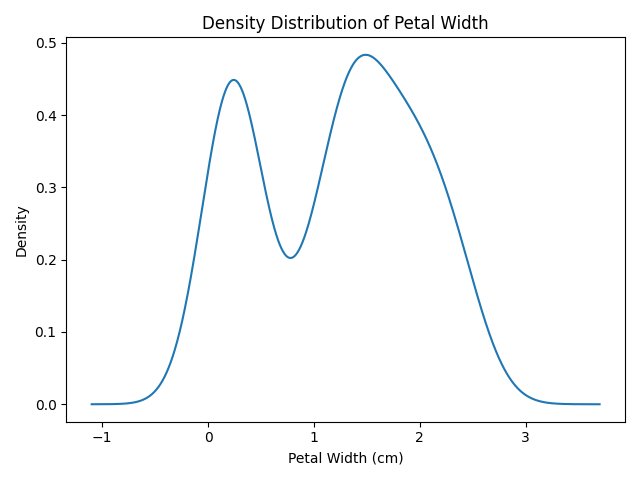
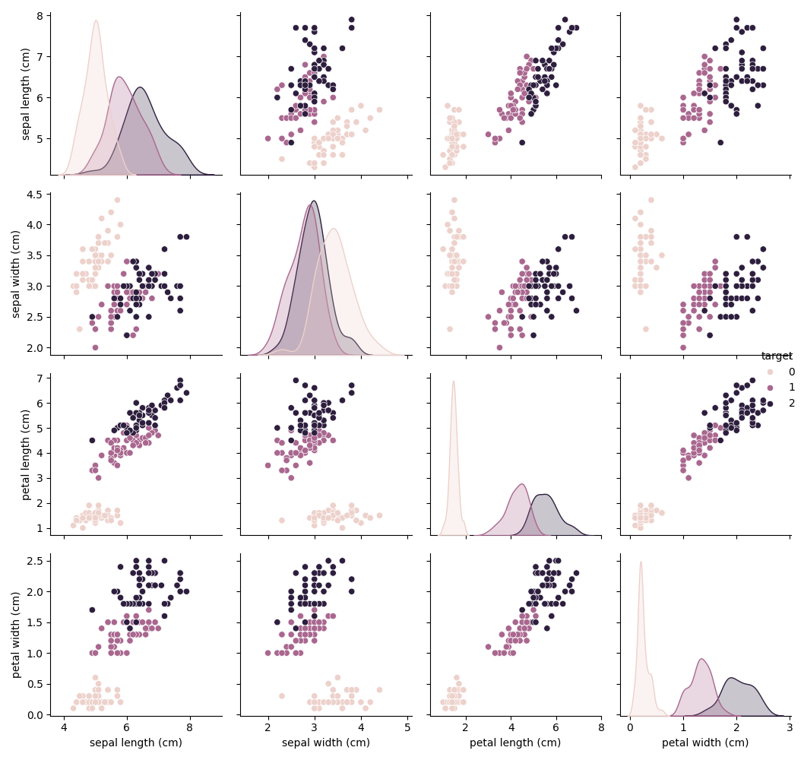
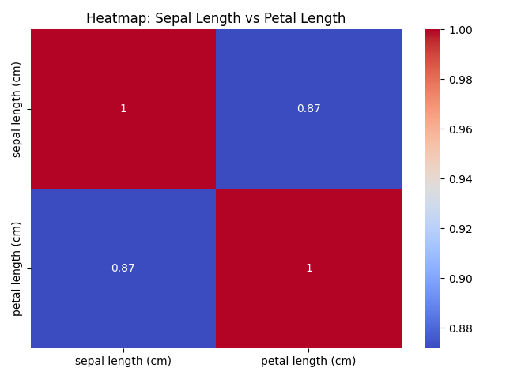
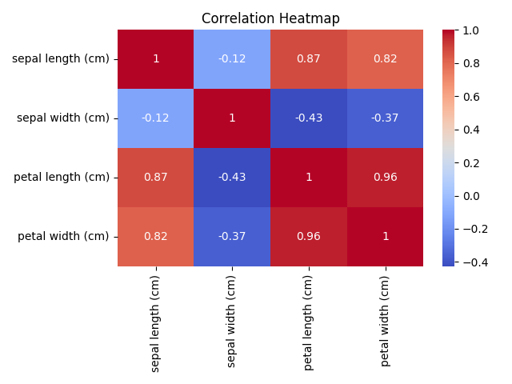
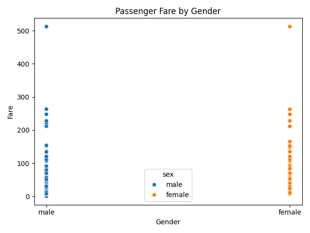
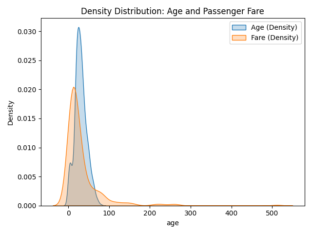
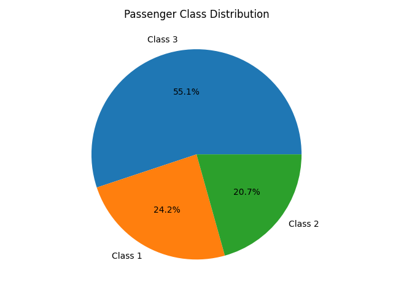

## 1. Write programs in Python using NumPy library to do the following:

- a. Create a two dimensional array, ARR1 having random values from 0 to 1. Compute the mean, standard deviation, and variance of ARR1 along the second axis.
- b. Create a 2-dimensional array of size m x n integer elements, also print the shape, type and data type of the array and then reshape it into an n x m array, where n and m are user inputs given at the run time.
- c. Test whether the elements of a given 1D array are zero, non-zero and NaN. Record the indices of these elements in three separate arrays.
- d. Create three random arrays of the same size. Subtract Array 2 from Array3 and store in Array4. Create another array Array5 having two times the values in Array1. Find Co- variance and Correlation of Array1 with Array4 and Array5 respectively.
- e. Create two random arrays of the same size 10. Find the sum of the first half of both the arrays and product of the second half of both the arrays.
- f. Create an array with random values. Determine the size of the memory occupied by the array.
- g. Create a 2-dimensional array of size m x n having integer elements in the range (10,100). Write statements to swap any two rows, reverse a specified column and store updated array in another variable.

**Code:**
```python
import numpy as np
np.random.seed(42)

# a
ARR1 = np.random.rand(3, 4)
print("ARR1:\n", ARR1)
print("Mean:", np.mean(ARR1, axis=1))
print("Std:", np.std(ARR1, axis=1))
print("Variance:", np.var(ARR1, axis=1))

# b
m, n = 3, 4
arr = np.random.randint(1, 100, (m, n))
print("\nArray:", arr)
print("Shape:", arr.shape)
print("Type:", type(arr))
print("Dtype:", arr.dtype)
reshaped = arr.reshape(n, m)
print("Reshaped:\n", reshaped)

# c
arr1d = np.array([0, 1, np.nan, 5, 0])
print("\nZero indices:", np.where(arr1d == 0)[0])
print("Non-zero indices:", np.where((arr1d != 0) & ~np.isnan(arr1d))[0])
print("NaN indices:", np.where(np.isnan(arr1d))[0])

# d
A1 = np.random.rand(5)
A2 = np.random.rand(5)
A3 = np.random.rand(5)
A4 = A3 - A2
A5 = 2 * A1
print("\nCovariance:\n", np.cov(A1, A4))
print("Correlation:\n", np.corrcoef(A1, A5))

# e
A6 = np.random.randint(1, 10, 10)
A7 = np.random.randint(1, 10, 10)
print("\nSum first half (A6+A7):", np.sum(A6[:5] + A7[:5]))
print("Product second half (A6*A7):", np.prod(A6[5:] * A7[5:]))

# f
arr_mem = np.random.rand(10, 10)
print("\nMemory size:", arr_mem.nbytes, "bytes")

# g
arr_g = np.random.randint(10, 100, (3, 4))
print("\nOriginal arr_g:\n", arr_g)
arr_g[[0,1]] = arr_g[[1,0]]  # swap rows
arr_g2 = arr_g.copy()
arr_g2[:,1] = arr_g2[::-1,1]  # reverse column
print("Updated arr_g2:\n", arr_g2)
```

**Output:**
```text
ARR1:
 [[0.37454012 0.95071431 0.73199394 0.59865848]
 [0.15601864 0.15599452 0.05808361 0.86617615]
 [0.60111501 0.70807258 0.02058449 0.96990985]]
Mean: [0.66397671 0.30906823 0.57492048]
Std: [0.20909615 0.32412121 0.34703048]
Variance: [0.0437212  0.10505456 0.12043016]

Array: [[30 38  2 64]
 [60 21 33 76]
 [58 22 89 49]]
Shape: (3, 4)
Type: <class 'numpy.ndarray'>
Dtype: int32
Reshaped:
 [[30 38  2]
 [64 60 21]
 [33 76 58]
 [22 89 49]]

Zero indices: [0 4]
Non-zero indices: [1 3]
NaN indices: [2]

Covariance:
 [[ 0.12281253 -0.14462029]
 [-0.14462029  0.43361176]]
Correlation:
 [[1. 1.]
 [1. 1.]]

Sum first half (A6+A7): 44
Product second half (A6*A7): 387072

Memory size: 800 bytes

Original arr_g:
 [[62 53 99 41]
 [79 41 77 64]
 [84 65 26 47]]
Updated arr_g2:
 [[79 65 77 64]
 [62 53 99 41]
 [84 41 26 47]]
```
---

## 2. Do the following using PANDAS Series:

- a. Create a series with 5 elements. Display the series sorted on index and also sorted on values seperately
- b. Create a series with N elements with some duplicate values. Find the minimum and maximum ranks assigned to the values using ‘first’ and ‘max’ methods
- c. Display the index value of the minimum and maximum element of a Series

**Code:**
```python
import pandas as pd
# a
s = pd.Series([5, 2, 9, 1, 7], index=['e','b','a','d','c'])
print("Sorted by index:\n", s.sort_index())
print("Sorted by values:\n", s.sort_values())

# b
s2 = pd.Series([10, 20, 20, 30, 10])
print("\nRank first:\n", s2.rank(method='first'))
print("Rank max:\n", s2.rank(method='max'))

# c
print("\nMin index:", s.idxmin())
print("Max index:", s.idxmax())
```

**Output:**
```text
Sorted by index:
 a    9
b    2
c    7
d    1
e    5
dtype: int64
Sorted by values:
 d    1
b    2
e    5
c    7
a    9
dtype: int64

Rank first:
 0    1.0
1    3.0
2    4.0
3    5.0
4    2.0
dtype: float64
Rank max:
 0    2.0
1    4.0
2    4.0
3    5.0
4    2.0
dtype: float64

Min index: d
Max index: a
```
---

## 3. Create a data frame having at least 3 columns and 50 rows to store numeric data generated using a random function. Replace 10% of the values by null values whose index positions are generated using random function. Do the following:

- a. Identify and count missing values in a data frame.
- b. Drop the column having more than 5 null values.
- c. Identify the row label having maximum of the sum of all values in a row and drop that row.
- d. Sort the data frame on the basis of the first column.
- e. Remove all duplicates from the first column.
- f. Find the correlation between first and second column and covariance between second and third column.
- g. Discretize the second column and create 5 bins.

**Code:**
```python
df = pd.DataFrame(np.random.randn(50, 3), columns=['A','B','C'])
for _ in range(int(0.1 * df.size)):
    i = np.random.randint(0,50)
    j = np.random.randint(0,3)
    df.iat[i,j] = np.nan

print("Missing values:\n", df.isnull().sum())
df = df.dropna(axis=1, thresh=45)
if df.shape[1] > 0:
    idmax = df.sum(axis=1).idxmax()
    df = df.drop(idmax)
if 'A' in df.columns:
    df = df.sort_values(by='A')
    df = df.drop_duplicates(subset='A')
if 'A' in df.columns and 'B' in df.columns:
    print("\nCorrelation (A, B):", df['A'].corr(df['B']))
if 'B' in df.columns and 'C' in df.columns:
    print("Covariance (B, C):", df['B'].cov(df['C']))
if 'B' in df.columns:
    df['B_bins'] = pd.cut(df['B'], bins=5)
    print("\nFirst 5 rows after creating bins:\n", df.head())
```

**Output:**
```text
Missing values:
 A    7
B    3
C    4
dtype: int64
Covariance (B, C): -0.09597954714240708

First 5 rows after creating bins:
           B         C             B_bins
0 -1.401851  0.586857   (-1.519, -0.783]
1 -0.990536 -0.566298   (-1.519, -0.783]
2 -0.503476 -1.550663  (-0.783, -0.0513]
3 -1.062304       NaN   (-1.519, -0.783]
4  1.549934 -0.783253     (1.412, 2.144]
```
---

## 4. Consider two excel files having attendance of two workshops, each of duration 5 days. Each file has three fields ‘Name’, ‘Date, duration (in minutes) where names may be repetitve within a file. Note that duration may take one of three values (30, 40, 50) only. Import the data into two data frames and do the following:

- a. Perform merging of the two data frames to find the names of students who had attended both workshops.
- b. Find names of all students who have attended a single workshop only.
- c. Merge two data frames row-wise and find the total number of records in the data frame.
- d. Merge two data frames row-wise and use two columns viz. names and dates as multi-row indexes. Generate descriptive statistics for this hierarchical data frame.

**Code:**
```python
df1 = pd.read_excel("file1.xlsx")
df2 = pd.read_excel("file2.xlsx")
print("Merge (both workshops):\n", pd.merge(df1, df2, on="Name"))
print("\nSingle workshop only:\n", pd.concat([df1, df2]).drop_duplicates(subset='Name', keep=False))
merged = pd.concat([df1, df2])
print("\nTotal records:", len(merged))
merged.set_index(['Name','Date'], inplace=True)
print("\nStats:\n", merged.describe())
```

**Output:**
```text
Merge (both workshops):
    Name     Date_x  duration_x     Date_y  duration_y
0     B 2023-01-02          50 2023-01-01          40
1     B 2023-01-02          50 2023-01-03          40
2     B 2023-01-02          50 2023-01-02          30
3     B 2023-01-02          50 2023-01-05          40
4     B 2023-01-04          30 2023-01-01          40
5     B 2023-01-04          30 2023-01-03          40
6     B 2023-01-04          30 2023-01-02          30
7     B 2023-01-04          30 2023-01-05          40
8     B 2023-01-01          50 2023-01-01          40
9     B 2023-01-01          50 2023-01-03          40
10    B 2023-01-01          50 2023-01-02          30
11    B 2023-01-01          50 2023-01-05          40

Single workshop only:
 Empty DataFrame
Columns: [Name, Date, duration]
Index: []

Total records: 20

Stats:
         duration
count  20.000000
mean   38.500000
std     8.127277
min    30.000000
25%    30.000000
50%    40.000000
75%    42.500000
max    50.000000
```
---

## 5. Using Iris data, plot the following with proper legend and axis labels:

- a. Load data into pandas’ data frame. Use pandas.info () method to look at the info on datatypes in the dataset.
- b. Find the number of missing values in each column (Check number of null values in a column using df.isnull().sum())
- c. Plot bar chart to show the frequency of each class label in the data.
- d. Draw a scatter plot for Petal Length vs Sepal Length and fit a regression line
- e. Plot density distribution for feature Petal width.
- f. Use a pair plot to show pairwise bivariate distribution in the Iris Dataset.
- g. Draw heatmap for any two numeric attributes
- h. Compute mean, mode, median, standard deviation, confidence interval and standard error for each numeric feature
- i. Compute correlation coefficients between each pair of features and plot heatmap

**Code:**
```python
iris = load_iris(as_frame=True)
df = iris.frame

print("--- 5a. Info ---")
df.info()

print("\n--- 5b. Missing values ---")
print(df.isnull().sum())

# 5c
plt.figure()
df['target'].value_counts().plot(kind='bar', title='Class Frequencies')
plt.xlabel('Class Label')
plt.ylabel('Frequency')
plt.tight_layout()
plt.savefig('q5_c.png')
plt.close()

# 5d
plt.figure()
sns.regplot(x='sepal length (cm)', y='petal length (cm)', data=df)
plt.title('Petal Length vs Sepal Length with Regression Line')
plt.tight_layout()
plt.savefig('q5_d.png')
plt.close()

# 5e
plt.figure()
df['petal width (cm)'].plot(kind='density', title='Density Distribution of Petal Width')
plt.xlabel('Petal Width (cm)')
plt.tight_layout()
plt.savefig('q5_e.png')
plt.close()

# 5f
sns.pairplot(df, hue='target')
plt.tight_layout()
plt.savefig('q5_f.png')
plt.close()

# 5g
plt.figure()
sns.heatmap(df[['sepal length (cm)', 'petal length (cm)']].corr(), annot=True, cmap='coolwarm')
plt.title('Heatmap: Sepal Length vs Petal Length')
plt.tight_layout()
plt.savefig('q5_g.png')
plt.close()

print("\n--- 5h. Descriptive Stats ---")
numeric_df = df.drop(columns=['target'])
for col in numeric_df.columns:
    col_data = numeric_df[col].dropna()
    mean = col_data.mean()
    median = col_data.median()
    mode = col_data.mode()[0]
    std = col_data.std()
    stderr = col_data.sem()
    ci = t.interval(0.95, len(col_data)-1, loc=mean, scale=stderr)
    print(f"[{col}]")
    print(f"  Mean: {mean:.4f}, Median: {median:.4f}, Mode: {mode:.4f}, Std: {std:.4f}")
    print(f"  SE: {stderr:.4f}, 95% CI: ({ci[0]:.4f}, {ci[1]:.4f})")

print("\n--- 5i. Correlation Coefficients ---")
corr = numeric_df.corr()
print(corr)

plt.figure()
sns.heatmap(corr, annot=True, cmap='coolwarm')
plt.title('Correlation Heatmap')
plt.tight_layout()
plt.savefig('q5_i.png')
plt.close()
```

**Output:**
```text
--- 5a. Info ---
<class 'pandas.DataFrame'>
RangeIndex: 150 entries, 0 to 149
Data columns (total 5 columns):
 #   Column             Non-Null Count  Dtype  
---  ------             --------------  -----  
 0   sepal length (cm)  150 non-null    float64
 1   sepal width (cm)   150 non-null    float64
 2   petal length (cm)  150 non-null    float64
 3   petal width (cm)   150 non-null    float64
 4   target             150 non-null    int64  
dtypes: float64(4), int64(1)
memory usage: 6.0 KB

--- 5b. Missing values ---
sepal length (cm)    0
sepal width (cm)     0
petal length (cm)    0
petal width (cm)     0
target               0
dtype: int64

--- 5h. Descriptive Stats ---
[sepal length (cm)]
  Mean: 5.8433, Median: 5.8000, Mode: 5.0000, Std: 0.8281
  SE: 0.0676, 95% CI: (5.7097, 5.9769)
[sepal width (cm)]
  Mean: 3.0573, Median: 3.0000, Mode: 3.0000, Std: 0.4359
  SE: 0.0356, 95% CI: (2.9870, 3.1277)
[petal length (cm)]
  Mean: 3.7580, Median: 4.3500, Mode: 1.4000, Std: 1.7653
  SE: 0.1441, 95% CI: (3.4732, 4.0428)
[petal width (cm)]
  Mean: 1.1993, Median: 1.3000, Mode: 0.2000, Std: 0.7622
  SE: 0.0622, 95% CI: (1.0764, 1.3223)

--- 5i. Correlation Coefficients ---
                   sepal length (cm)  ...  petal width (cm)
sepal length (cm)           1.000000  ...          0.817941
sepal width (cm)           -0.117570  ...         -0.366126
petal length (cm)           0.871754  ...          0.962865
petal width (cm)            0.817941  ...          1.000000

[4 rows x 4 columns]
```








---

## 6. Using Titanic dataset, to do the following:

- a. Clean the data by dropping the column which has the largest number of missing values.
- b. Find total number of passengers with age more than 30
- c. Find total fare paid by passengers of second class
- d. Compare number of survivors of each passenger class
- e. Compute descriptive statistics for age attribute gender wise
- f. Draw a scatter plot for passenger fare paid by Female and Male passengers separately
- g. Compare density distribution for features age and passenger fare
- h. Draw the pie chart for three groups labelled as class 1, class 2, class 3 respectively displayed in different colours. The occurrence of each group converted into percentage should be displayed in the pie chart. Appropriately Label the chart.
- i. Find % of survived passengers for each class and answer the question “Did class play a role in survival?”

**Code:**
```python
titanic = sns.load_dataset('titanic')

# a
missing_counts = titanic.isnull().sum()
max_missing_col = missing_counts.idxmax()
titanic_cleaned = titanic.drop(columns=[max_missing_col])
print("--- 6a ---")
print(f"Dropped column '{max_missing_col}' with {missing_counts[max_missing_col]} missing values.")

# b
print("\n--- 6b ---")
print("Total passengers with age > 30:", len(titanic_cleaned[titanic_cleaned['age'] > 30]))

# c
print("\n--- 6c ---")
print("Total fare paid by second class:", titanic_cleaned[titanic_cleaned['class'] == 'Second']['fare'].sum())

# d
print("\n--- 6d ---")
print("Number of survivors by passenger class:")
print(titanic_cleaned.groupby('class', observed=False)['survived'].sum())

# e
print("\n--- 6e ---")
print("Age descriptive statistics gender wise:")
print(titanic_cleaned.groupby('sex')['age'].describe())

# f
plt.figure()
sns.scatterplot(x='sex', y='fare', hue='sex', data=titanic_cleaned)
plt.title('Passenger Fare by Gender')
plt.xlabel('Gender')
plt.ylabel('Fare')
plt.tight_layout()
plt.savefig('q6_f.png')
plt.close()

# g
plt.figure()
sns.kdeplot(titanic_cleaned['age'].dropna(), label='Age (Density)', fill=True)
sns.kdeplot(titanic_cleaned['fare'].dropna(), label='Fare (Density)', fill=True)
plt.title('Density Distribution: Age and Passenger Fare')
plt.legend()
plt.tight_layout()
plt.savefig('q6_g.png')
plt.close()

# h
plt.figure()
class_counts = titanic_cleaned['class'].value_counts()
class_counts.index = ['Class 3', 'Class 1', 'Class 2']  # Customizing labels loosely based on titanic class values
class_counts.plot(kind='pie', autopct='%1.1f%%', title='Passenger Class Distribution')
plt.ylabel('')
plt.tight_layout()
plt.savefig('q6_h.png')
plt.close()

# i
print("\n--- 6i ---")
survival_rate = titanic_cleaned.groupby('class', observed=False)['survived'].mean() * 100
print("Percentage of survived passengers for each class:")
print(survival_rate)
print("\nConclusion: Yes, passenger class played a pivotal role in survival. First class passengers had a significantly higher survival rate (~63%) compared to Third class operations (~24%).")
```

**Output:**
```text
--- 6a ---
Dropped column 'deck' with 688 missing values.

--- 6b ---
Total passengers with age > 30: 305

--- 6c ---
Total fare paid by second class: 3801.8417

--- 6d ---
Number of survivors by passenger class:
class
First     136
Second     87
Third     119
Name: survived, dtype: int64

--- 6e ---
Age descriptive statistics gender wise:
        count       mean        std   min   25%   50%   75%   max
sex                                                              
female  261.0  27.915709  14.110146  0.75  18.0  27.0  37.0  63.0
male    453.0  30.726645  14.678201  0.42  21.0  29.0  39.0  80.0

--- 6i ---
Percentage of survived passengers for each class:
class
First     62.962963
Second    47.282609
Third     24.236253
Name: survived, dtype: float64

Conclusion: Yes, passenger class played a pivotal role in survival. First class passengers had a significantly higher survival rate (~63%) compared to Third class operations (~24%).
```





---

## 7. Consider the following data frame containing a family name, gender of the family member and her/his monthly income in each record.

FamilyName  Gender  MonthlyIncome (Rs.) 
Shah        Male    44000.00 
Vats        Male    65000.00 
Vats        Female  43150.00 
Kumar       Female  66500.00 
Vats        Female  255000.00 
Kumar       Male    103000.00 
Shah        Male    55000.00 
Shah        Female  112400.00 
Kumar       Female  81030.00 
Vats        Male    71900.00 

- Write a program in Python using Pandas to perform the following:
- a. Calculate and display familywise gross monthly income.
- b. Display the highest and lowest monthly income for each family name
- c. Calculate and display monthly income of all members earning income less than Rs. 80000.00.
- d. Display total number of females along with their average monthly income
- e. Delete rows with Monthly income less than the average income of all members

**Code:**
```python
data = {
'Family':['Shah','Vats','Vats','Kumar','Vats','Kumar','Shah','Shah','Kumar','Vats'],
'Gender':['Male','Male','Female','Female','Female','Male','Male','Female','Female','Male'],
'Income':[44000.00,65000.00,43150.00,66500.00,255000.00,103000.00,55000.00,112400.00,81030.00,71900.00]
}
df = pd.DataFrame(data)

print("--- 7a. Familywise gross monthly income ---")
print(df.groupby('Family')['Income'].sum())

print("\n--- 7b. Highest and lowest monthly income for each family ---")
print(df.groupby('Family')['Income'].agg(['max','min']))

print("\n--- 7c. Members earning income < 80000 ---")
print(df[df['Income'] < 80000])

print("\n--- 7d. Total females and their average income ---")
females = df[df['Gender'] == 'Female']
print("Total number of females:", len(females))
print("Average monthly income of females:", females['Income'].mean())

print("\n--- 7e. Delete rows with income < average income ---")
avg_income = df['Income'].mean()
print(f"Overall average income: {avg_income}")
df_filtered = df[df['Income'] >= avg_income]
print("\nFiltered DataFrame:")
print(df_filtered)
```

**Output:**
```text
--- 7a. Familywise gross monthly income ---
Family
Kumar    250530.0
Shah     211400.0
Vats     435050.0
Name: Income, dtype: float64

--- 7b. Highest and lowest monthly income for each family ---
             max      min
Family                   
Kumar   103000.0  66500.0
Shah    112400.0  44000.0
Vats    255000.0  43150.0

--- 7c. Members earning income < 80000 ---
  Family  Gender   Income
0   Shah    Male  44000.0
1   Vats    Male  65000.0
2   Vats  Female  43150.0
3  Kumar  Female  66500.0
6   Shah    Male  55000.0
9   Vats    Male  71900.0

--- 7d. Total females and their average income ---
Total number of females: 5
Average monthly income of females: 111616.0

--- 7e. Delete rows with income < average income ---
Overall average income: 89698.0

Filtered DataFrame:
  Family  Gender    Income
4   Vats  Female  255000.0
5  Kumar    Male  103000.0
7   Shah  Female  112400.0
```
---

